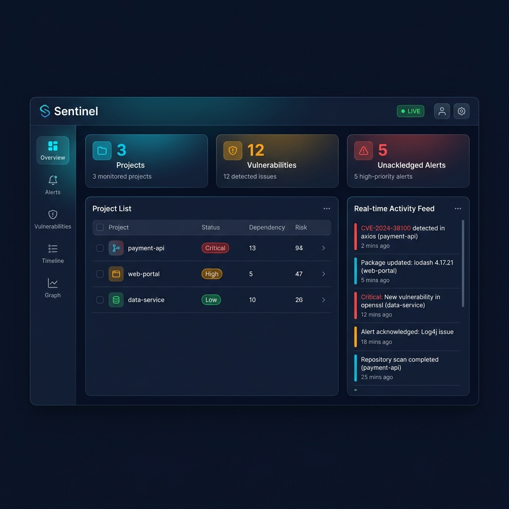
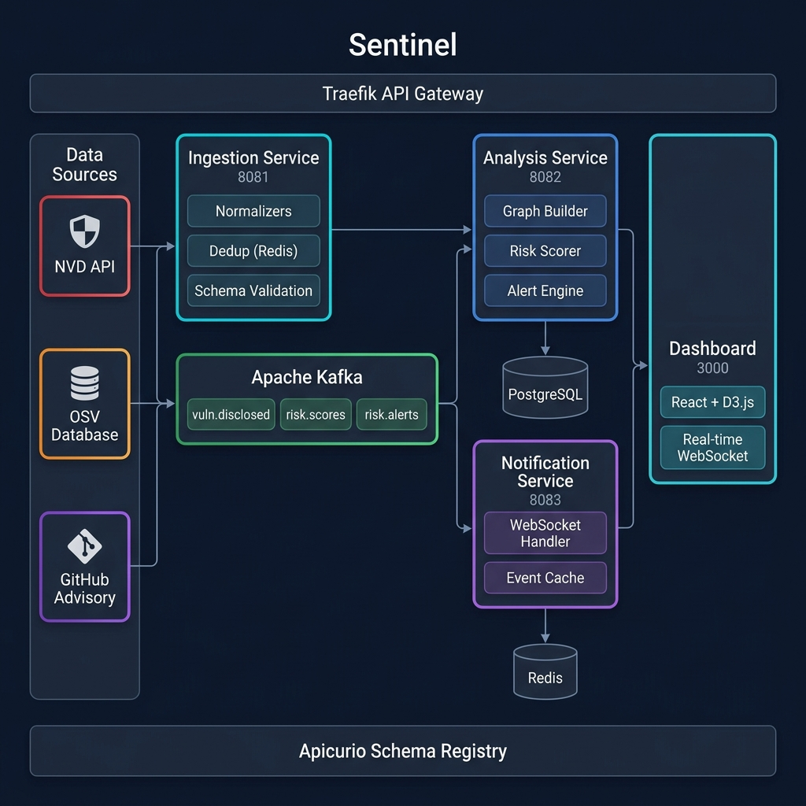
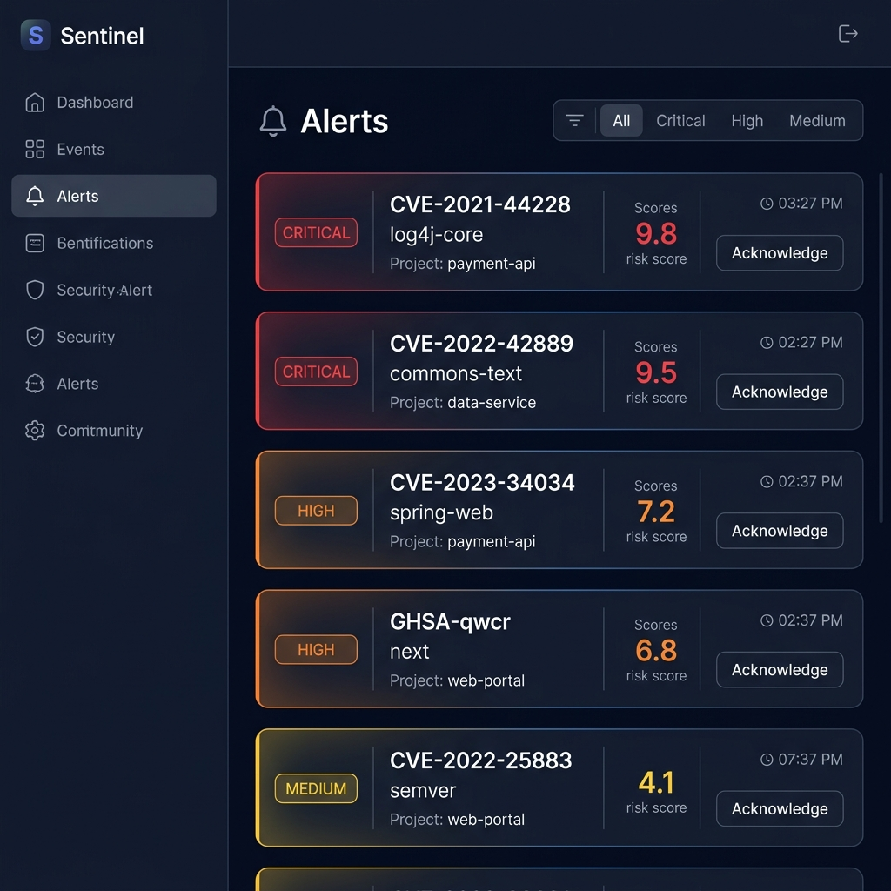
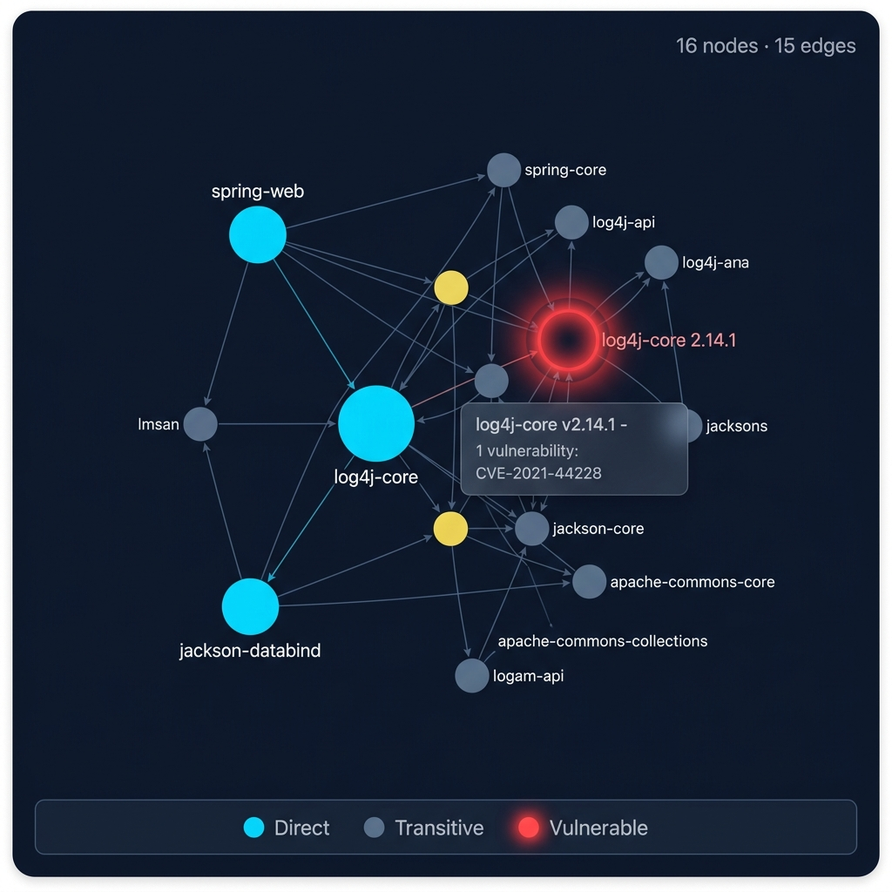

[](https://openjdk.org/projects/jdk/21/)
[](https://spring.io/projects/spring-boot)
[](https://kafka.apache.org/)
[](https://react.dev/)
[](https://www.typescriptlang.org/)
[](LICENSE)

# Sentinel — Real-Time Software Supply Chain Risk Monitor

**Sentinel** is an event-driven microservices platform that continuously monitors software dependencies for security vulnerabilities, scores risk across the full dependency graph, and delivers real-time alerts through a live dashboard — built with Java 21, Spring Boot 3, Apache Kafka, React, and D3.js.

<br>



## Table of Contents

- [Why This Exists](#why-this-exists)
- [Architecture](#architecture)
- [Functional Services](#functional-services)
  - [Ingestion Service](#ingestion-service)
  - [Analysis Service](#analysis-service)
  - [Notification Service](#notification-service)
- [Dashboard & Visualization](#dashboard--visualization)
- [Infrastructure](#infrastructure)
  - [Apache Kafka](#apache-kafka)
  - [PostgreSQL](#postgresql)
  - [Redis](#redis)
  - [Apicurio Schema Registry](#apicurio-schema-registry)
  - [Traefik API Gateway](#traefik-api-gateway)
- [Risk Scoring Engine](#risk-scoring-engine)
- [How to Run](#how-to-run)
- [Testing](#testing)
- [Project Structure](#project-structure)
- [Tech Stack](#tech-stack)

---

## Why This Exists

Modern software projects depend on hundreds of transitive dependencies. A single compromised package deep in the tree can silently propagate risk upward. Most existing tools perform point-in-time scans, but supply chain attacks happen continuously. Sentinel treats dependency monitoring as a **streaming problem**.

### The Key Insight

Traditional tools answer: *"Does this project have a known vulnerability?"* — a binary yes/no.

Sentinel answers: *"How much risk does this vulnerability actually pose, given the dependency graph topology?"* A moderate-severity CVE (CVSS 5.0) reachable through 8 transitive paths is objectively more dangerous than a high-severity CVE (CVSS 7.0) behind a single direct dependency — but no existing tool quantifies this.

| Capability | Dependency-Track | Snyk | OSV-Scanner | **Sentinel** |
|---|---|---|---|---|
| **Detection model** | Batch SBOM import | CI/CD scan | CLI point-in-time | **Real-time Kafka streaming** |
| **Transitive risk** | Binary affected/not | Reachability (paid) | Binary | **Multi-factor graph scoring** |
| **Dashboard updates** | Refresh on load | Polling | None (CLI) | **WebSocket push** |
| **Architecture** | Monolith | SaaS | CLI | **Event-driven microservices** |
| **Hidden amplifier detection** | No | No | No | **Yes** |

---

## Architecture

Sentinel follows an event-driven microservices architecture with Apache Kafka as the central nervous system. Each service has a single responsibility and communicates exclusively through Kafka topics.



### Data Flow

1. **External vulnerability feeds** (NVD, OSV, GitHub Advisory) push events to the Ingestion Service via REST webhooks
2. **Ingestion Service** normalizes, deduplicates, validates schema, and publishes to the `vuln.disclosed` Kafka topic
3. **Analysis Service** consumes events, upserts into PostgreSQL, builds the dependency graph, computes multi-factor risk scores, and generates alerts
4. **Notification Service** consumes `risk.scores` and `risk.alerts` topics, caches events in Redis, and pushes updates to connected dashboard clients via WebSocket
5. **Dashboard** renders real-time data including interactive D3.js dependency graph visualizations

```
NVD / OSV / GitHub ──► Ingestion ──► Kafka ──► Analysis ──► Kafka ──► Notification ──► Dashboard
                         :8081              vuln.disclosed    :8082     risk.scores      :8083          :3000
                                                                       risk.alerts
                       ┌─────────┐                          ┌──────────┐              ┌───────┐
                       │  Redis  │                          │PostgreSQL│              │ Redis │
                       │ (dedup) │                          │ (store)  │              │(cache)│
                       └─────────┘                          └──────────┘              └───────┘
```

---

## Functional Services

Sentinel is decomposed into three core microservices. All are independently deployable Spring Boot applications organized around distinct business domains.

### Ingestion Service

The entry point for all vulnerability data. Receives events from external feeds, normalizes them into a canonical format, deduplicates using Redis (24h TTL), validates against the Apicurio schema registry, and publishes to Kafka.

Method | Path | Description
--- | --- | ---
POST | `/webhooks/github` | Receive GitHub Advisory webhook events
POST | `/webhooks/npm` | Receive npm registry webhook events
POST | `/api/ingest/vulnerability` | Manually submit a vulnerability event
POST | `/api/ingest/dependency-update` | Submit a dependency tree update

#### Notes
- Each source (NVD, OSV, GitHub) has a dedicated normalizer that maps vendor-specific formats to Sentinel's canonical `VulnerabilityEvent` schema
- Redis-backed deduplication prevents the same CVE from being processed multiple times within a 24-hour window
- Events are validated against the Apicurio schema registry before publishing to Kafka

#### Source Normalizers

```java
// Each normalizer maps vendor-specific severity to Sentinel's canonical model
NvdNormalizer     → maps CVSS v3.1 metrics + CWE references
OsvNormalizer     → maps OSV ecosystem identifiers + affected ranges
GitHubNormalizer  → maps GHSA IDs + CVSS scores from advisory API
```

---

### Analysis Service

The brain of the system. Consumes vulnerability events from Kafka, persists them, builds an in-memory dependency graph, computes multi-factor risk scores using graph topology, and generates alerts when scores exceed configurable thresholds.

Method | Path | Description
--- | --- | ---
GET | `/api/projects` | List all monitored projects
GET | `/api/projects/{id}` | Get project details
POST | `/api/projects` | Register a new project
GET | `/api/projects/{id}/risk-scores` | Get latest risk scores for a project
GET | `/api/projects/{id}/risk-scores/history` | Get risk score history (time series)
GET | `/api/projects/{id}/alerts` | Get project alerts
GET | `/api/alerts` | Get all unacknowledged alerts
POST | `/api/alerts/{id}/acknowledge` | Acknowledge an alert
GET | `/api/vulnerabilities` | List all tracked vulnerabilities
GET | `/api/vulnerabilities/{cveId}` | Get vulnerability details by CVE ID
GET | `/api/projects/{id}/graph` | Get D3-compatible dependency graph data
GET | `/api/dashboard/summary` | Get aggregated dashboard summary

#### Notes
- Vulnerability upsert logic: if a CVE is re-reported with a higher CVSS score, the existing record is updated (not duplicated)
- The dependency graph is built from JSON snapshots and stored as an adjacency-list structure with BFS path finding
- Risk scores are published to the `risk.scores` Kafka topic; alerts to `risk.alerts`

---

### Notification Service

The real-time delivery layer. Consumes scored events from Kafka and pushes them to connected dashboard clients via reactive WebSocket. Maintains a Redis-backed event cache for clients that connect after events have fired.

Method | Path | Description
--- | --- | ---
WS | `/ws/alerts` | WebSocket endpoint for real-time alert streaming
GET | `/api/notifications/status` | Connection status and active session count
GET | `/api/notifications/scores/recent` | Recent risk score events (cached)
GET | `/api/notifications/alerts/recent` | Recent alert events (cached)
GET | `/api/notifications/scores/project/{id}` | Recent scores for a specific project

#### Notes
- WebSocket sessions are tracked in a thread-safe registry with automatic cleanup on disconnect
- Redis `LPUSH`/`LTRIM` pattern maintains a bounded cache of the most recent events
- Supports multiple concurrent dashboard connections

---

## Dashboard & Visualization

The React dashboard provides a real-time view of the entire supply chain security posture with live WebSocket updates and interactive D3.js visualizations.



### Pages

| Page | Description |
|------|-------------|
| **Overview** | Stat cards, project list with risk badges, real-time activity feed |
| **Alerts** | Filterable alert list with severity badges, risk scores, acknowledge actions |
| **Vulnerabilities** | Searchable CVE table with source indicators and severity breakdown |
| **Timeline** | Chronological event feed with animated entries |
| **Graph** | Interactive D3.js dependency graph visualization |
| **Project Detail** | Per-project risk scores, dependency tree, and alert history |

### Dependency Graph Visualization



The graph visualization uses D3.js force-directed layout with:

- **Color-coded nodes**: 🔴 Red (vulnerable), 🔵 Cyan (direct dependency), ⚫ Slate (transitive)
- **Interactive features**: zoom/pan, drag nodes, hover highlighting, search with yellow glow
- **Glassmorphism tooltips** showing package details, version, and linked CVEs
- **Node detail panel** with clickable NVD links for each vulnerability

---

## Infrastructure

### Apache Kafka

Kafka serves as the central nervous system. All inter-service communication flows through Kafka topics — there are no synchronous REST calls between services.

Topic | Partitions | Producers | Consumers
--- | :---: | --- | ---
`vuln.disclosed` | 6 | Ingestion | Analysis
`risk.scores` | 3 | Analysis | Notification
`risk.alerts` | 3 | Analysis | Notification
`dependency.updated` | 6 | Ingestion | Analysis
`package.released` | 6 | Ingestion | Analysis
`risk.scores.dlq` | 1 | Analysis | —

Kafka runs in **KRaft mode** (no ZooKeeper dependency), configured via the `apache/kafka:3.7.0` image.

---

### PostgreSQL

PostgreSQL 16 stores all persistent data for the Analysis Service, including projects, vulnerabilities, risk scores, alerts, and dependency snapshots.

```
dependency_snapshots  →  JSONB dependency trees
vulnerabilities       →  CVE records with CVSS scores
risk_scores           →  Computed scores with factor breakdown
alerts                →  Threshold-triggered notifications
projects              →  Monitored repositories
```

Schema migrations are managed by **Flyway** — all migrations live in `sentinel-analysis/src/main/resources/db/migration/`.

---

### Redis

Redis serves two distinct purposes across two different services:

| Service | Use Case | Pattern |
|---------|----------|---------|
| Ingestion | CVE deduplication | `SETEX` with 24h TTL |
| Notification | Recent event cache | `LPUSH` / `LTRIM` bounded list |

---

### Apicurio Schema Registry

[Apicurio Registry](https://www.apicur.io/registry/) provides runtime schema validation for Kafka messages. The Ingestion Service validates `VulnerabilityEvent` payloads against registered JSON schemas before publishing, ensuring downstream consumers never receive malformed data.

```
http://localhost:8085  →  Apicurio Registry UI
```

---

### Traefik API Gateway

[Traefik v3](https://traefik.io/) acts as the API gateway, automatically discovering services via Docker labels and routing requests:

| Route | Service | Port |
|-------|---------|------|
| `/webhooks/*`, `/api/ingest/*` | Ingestion | 8081 |
| `/api/projects/*`, `/api/alerts/*` | Analysis | 8082 |
| `/ws/*` | Notification | 8083 |
| `/` (default) | Dashboard | 3000 |

```
http://localhost:80    →  Application (via Traefik)
http://localhost:8090  →  Traefik Dashboard
```

---

## Risk Scoring Engine

Sentinel's risk scoring engine goes beyond raw CVSS by incorporating dependency graph topology into the score calculation. The multi-factor model is inspired by research on cross-level risk propagation in software supply chains.

### Scoring Formula

```
RiskScore = CVSS × DepthDecay × FanOutBoost × FreshnessDecay × DirectBoost
```

| Factor | Formula | Purpose |
|--------|---------|---------|
| **CVSS Base** | Raw score (0–10) | Severity foundation |
| **Depth Decay** | `1 / (1 + 0.3 × depth)` | Deeper = less reachable |
| **Fan-Out Boost** | `1 + log₂(pathCount)` | Multiple paths amplify risk |
| **Freshness Decay** | `e^(-0.001 × daysSincePublished)` | Older vulns lose urgency |
| **Direct Boost** | `1.5× if direct, 1.0× otherwise` | Direct deps are more exploitable |

### Why This Matters

Consider two vulnerabilities in the same project:

| Vulnerability | CVSS | Depth | Paths | **Sentinel Score** |
|---|:---:|:---:|:---:|:---:|
| CVE-A (direct dep) | 6.0 | 1 | 1 | **6.9** |
| CVE-B (transitive, 4 paths) | 5.0 | 3 | 4 | **4.2** |

Traditional tools would rank CVE-A higher (CVSS 6.0 > 5.0). Sentinel agrees in this case — but if CVE-B had 16 paths, its fan-out boost would push it to **7.1**, correctly identifying it as the greater risk. This is the "hidden amplifier" pattern that binary scanners miss.

For a detailed explanation of the scoring methodology, see [docs/SCORING.md](docs/SCORING.md).

---

## How to Run

### Prerequisites

- **Docker** & **Docker Compose** (v2+)
- **Java 21** (for local development)
- **Node.js 20+** (for dashboard development)
- **Maven 3.9+** (included via `mvnw`)

### Quick Start

```bash
# Clone the repository
git clone https://github.com/your-username/sentinel.git
cd sentinel

# Start everything with demo data (3 projects, 12 CVEs)
make demo

# Or start without demo data
make up
```

The demo seeder populates the database with realistic data:
- **3 projects**: `payment-api` (Maven), `web-portal` (NPM), `data-service` (Maven)
- **12 real-world CVEs** across all severity levels from NVD, OSV, and GitHub Advisory
- **Risk scores and alerts** computed via the real analysis pipeline

### Service URLs

| Service | URL |
|---------|-----|
| Dashboard | http://localhost:3000 |
| Traefik Gateway | http://localhost:80 |
| Traefik Dashboard | http://localhost:8090 |
| Ingestion API | http://localhost:8081 |
| Analysis API | http://localhost:8082 |
| Notification API | http://localhost:8083 |
| Apicurio Registry | http://localhost:8085 |

### Makefile Targets

```bash
make help              # Show all available targets
make infra             # Start infrastructure only (Kafka, PostgreSQL, Redis, etc.)
make build             # Build all backend modules
make test              # Run all unit tests
make integration-test  # Run integration tests
make up                # Start everything
make demo              # Start everything with demo data
make down              # Stop all containers
make clean             # Stop all containers and remove volumes
make logs              # Tail all service logs
make health            # Check health of all services
```

### Environment Variables

Copy `.env.example` to `.env` and configure:

| Variable | Description | Default |
|----------|-------------|---------|
| `POSTGRES_DB` | Database name | `sentinel` |
| `POSTGRES_USER` | Database user | `sentinel` |
| `POSTGRES_PASSWORD` | Database password | `sentinel_dev` |
| `NVD_API_KEY` | NVD API key (optional, increases rate limits) | — |
| `GITHUB_PAT` | GitHub Personal Access Token (for Advisory API) | — |
| `GITHUB_WEBHOOK_SECRET` | GitHub webhook HMAC secret | — |

---

## Testing

### Test Suite

| Module | Tests | Description |
|--------|:-----:|-------------|
| sentinel-ingestion | 15 | Controller tests, source normalizers (NVD, OSV, GitHub) |
| sentinel-analysis | 23 | Graph construction, risk scoring, pipeline integration (7 E2E tests) |
| sentinel-notification | 3 | WebSocket session registry |
| **Total** | **41** | **All passing** ✅ |

```bash
# Run all tests
make test

# Run a specific module's tests
mvn test -pl sentinel-analysis

# Run integration tests only
mvn test -pl sentinel-analysis -Dtest="FullPipelineIntegrationTest"
```

### Integration Test Coverage

The `FullPipelineIntegrationTest` verifies the complete pipeline with H2 in-memory database (PostgreSQL mode):

1. **Graph construction** — 8-node dependency tree from JSON
2. **Depth scoring** — CVSS 10.0 at depth 1 → score > 7.0
3. **Transitive decay** — CVSS 6.6 at depth 2 → score < 6.6
4. **D3 serialization** — nodes/edges with vulnerable flags
5. **Vulnerability upsert** — event → DB persistence
6. **CVSS upsert** — score upgrade from 5.0 → 9.0
7. **Alert acknowledgment** — flag + timestamp + filtered queries

---

## Project Structure

```
sentinel/
├── sentinel-common/           # Shared models, events, DTOs
│   └── src/main/java/
│       └── com/sentinel/common/
│           ├── event/         # VulnerabilityEvent record
│           └── model/         # Severity, Ecosystem, EventSource enums
│
├── sentinel-ingestion/        # Data ingestion service (:8081)
│   └── src/main/java/
│       └── com/sentinel/ingestion/
│           ├── controller/    # Webhook + manual ingest endpoints
│           ├── normalizer/    # NVD, OSV, GitHub format normalizers
│           ├── publisher/     # Kafka event publisher
│           └── dedup/         # Redis-backed deduplication
│
├── sentinel-analysis/         # Risk analysis service (:8082)
│   └── src/main/java/
│       └── com/sentinel/analysis/
│           ├── controller/    # REST API (projects, alerts, graph)
│           ├── service/       # Analysis orchestration
│           ├── graph/         # DependencyGraph, GraphBuilder
│           ├── scoring/       # Multi-factor RiskScorer
│           ├── entity/        # JPA entities
│           ├── repository/    # Spring Data repositories
│           ├── consumer/      # Kafka consumer
│           └── demo/          # DemoDataSeeder
│
├── sentinel-notification/     # Real-time notification service (:8083)
│   └── src/main/java/
│       └── com/sentinel/notification/
│           ├── controller/    # REST + WebSocket endpoints
│           ├── consumer/      # Kafka consumers
│           └── websocket/     # Session registry + handler
│
├── sentinel-dashboard/        # React + TypeScript frontend (:3000)
│   └── src/
│       ├── components/        # Reusable UI components
│       │   └── graph/         # D3.js dependency graph
│       ├── pages/             # Route pages
│       ├── services/          # API client + WebSocket
│       └── styles/            # CSS design system
│
├── docs/                      # Documentation & images
├── docker-compose.yml         # Full stack orchestration
├── docker-compose.dev.yml     # Infrastructure-only (local dev)
├── docker-compose.demo.yml    # Demo data seeder profile
├── Makefile                   # Developer workflow targets
└── pom.xml                    # Maven parent POM
```

---

## Tech Stack

| Layer | Technology | Version |
|-------|-----------|---------|
| **Language** | Java (OpenJDK) | 21 |
| **Framework** | Spring Boot | 3.3.6 |
| **Messaging** | Apache Kafka (KRaft) | 3.7.0 |
| **Database** | PostgreSQL | 16 |
| **Caching** | Redis | 7 |
| **Schema Registry** | Apicurio Registry | 2.6.4 |
| **API Gateway** | Traefik | 3.1 |
| **Frontend** | React + TypeScript | 19 / 5.6 |
| **Visualization** | D3.js | 7 |
| **Build Tool** | Maven | 3.9+ |
| **Migrations** | Flyway | 10+ |
| **Containerization** | Docker Compose | v2+ |

---

## License

This project is licensed under the MIT License — see the [LICENSE](LICENSE) file for details.
